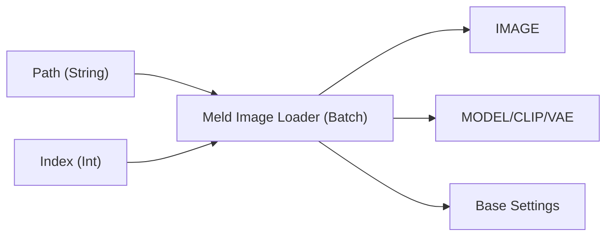

# Meld Image Loader (Batch) (MeldImageLoaderBatch)

This node loads images from a specified directory based on an index. It is suitable for batch processing or sequential image loading.
Like the `Meld Image Loader`, it also parses and restores metadata (prompts, models, settings) embedded in the image.

## Workflow Connection

## Inputs

### Required

| Name | Type | Default | Description |
| :--- | :--- | :--- | :--- |
| **directory_path** | `STRING` | `"C:\Images"` | The absolute path to the directory containing image files (.png, .jpg, .webp, etc.). |
| **index** | `INT` | `0` | The index of the image to load (0-based). Images are selected from a list sorted by filename. |
| **stop_at_limit** | `BOOLEAN` | `False` | If `True`, raises an error and stops processing when `index` is greater than or equal to the number of files. If `False`, it loops back to the beginning (modulo operation). |

## Outputs

| Name | Type | Description |
| :--- | :--- | :--- |
| **IMAGE** | `IMAGE` | The loaded image data. |
| **MODEL** | `MODEL` | The model (Checkpoint) identified from metadata and loaded. Returns `None` if loading fails. |
| **CLIP** | `CLIP` | The CLIP from the loaded model. |
| **VAE** | `VAE` | The VAE from the loaded model. |
| **positive** | `STRING` | The positive prompt extracted from the image. |
| **negative** | `STRING` | The negative prompt extracted from the image. |
| **summary** | `STRING` | A summary log of detected parameters and model information. |
| **base_settings** | `BASE_SETTINGS` | A dictionary containing seed, steps, CFG, sampler name, etc. (for use with `Meld Settings Unpacker`). |

## Tips & Mechanics

*   **Batch Processing**: By converting the `index` input to a `Primitive` node and setting "control_after_generate" to "increment" in the widget control, you can process images in the directory sequentially with each Queue execution (or by increasing Batch Count).
*   **Auto-Loop**: If `stop_at_limit` is `False`, the index is calculated as `index % total_files`, so it will loop back to the start of the list without error even if the index exceeds the file count.
*   **Metadata Parsing**: Supports both ComfyUI workflow JSON and A1111 format text, attempting to restore original generation settings as much as possible.
*   **Auto Model Loading**: If a model name is found in the metadata, it attempts to find and load the closest matching model from the checkpoints folder.
