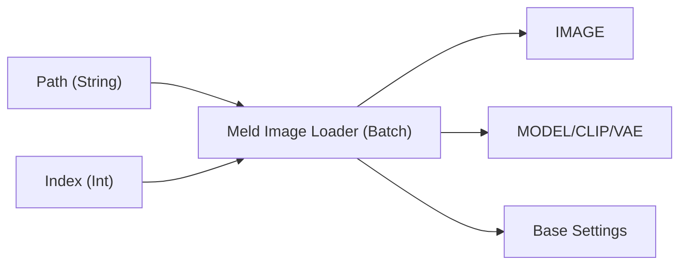

# Meld Image Loader (Batch) (MeldImageLoaderBatch)

指定したディレクトリ内の画像を、インデックスに基づいて読み込むノードです。バッチ処理や連続的な画像の読み込みに適しています。
`Meld Image Loader` と同様に、画像に含まれるメタデータ（プロンプト、モデル、設定）の解析と復元も行います。

## 接続イメージ

## 入力 (Inputs)

### Required

| 名前 | 型 | デフォルト | 説明 |
| :--- | :--- | :--- | :--- |
| **directory_path** | `STRING` | `"C:\Images"` | 画像ファイル（.png, .jpg, .webp等）が保存されているディレクトリの絶対パスを指定します。 |
| **index** | `INT` | `0` | 読み込む画像のインデックス（0始まり）。ファイル名の昇順でソートされたリストから選択されます。 |
| **stop_at_limit** | `BOOLEAN` | `False` | `True` の場合、`index` がディレクトリ内のファイル数以上になるとエラーを発生させて処理を停止します。`False` の場合は、最初に戻って（ループして）読み込みます。 |

## 出力 (Outputs)

| 名前 | 型 | 説明 |
| :--- | :--- | :--- |
| **IMAGE** | `IMAGE` | 読み込まれた画像データ。 |
| **MODEL** | `MODEL` | メタデータから特定され、ロードされたモデル（CheckPoint）。ロード失敗時は `None`。 |
| **CLIP** | `CLIP` | ロードされたモデルのCLIP。 |
| **VAE** | `VAE` | ロードされたモデルのVAE。 |
| **positive** | `STRING` | 画像から抽出されたポジティブプロンプト。 |
| **negative** | `STRING` | 画像から抽出されたネガティブプロンプト。 |
| **summary** | `STRING` | 検出されたパラメータやモデル情報のログ要約。 |
| **base_settings** | `BASE_SETTINGS` | シード、ステップ数、CFG、サンプラー名などを格納した辞書データ（`Meld Settings Unpacker` 等で使用）。 |

## 仕組みとヒント

*   **バッチ処理**: `index` 入力を `Primitive` ノードに変換し、コントロールウィジェットで "control_after_generate": "increment" に設定することで、Queue を実行するたびに（または Batch Count を増やして実行することで）ディレクトリ内の画像を順番に処理できます。
*   **自動ループ**: `stop_at_limit` が `False` の場合、インデックスは `index % total_files` として計算されるため、ファイル数を超えてもエラーにならず、リストの先頭に戻ります。
*   **メタデータ解析**: ComfyUI のワークフローJSON、A1111形式のテキスト情報の両方に対応しており、可能な限り元の生成設定を復元します。
*   **モデルの自動ロード**: メタデータにモデル名が含まれている場合、チェックポイントフォルダから最も近い名前のモデルを探してロードを試みます。
